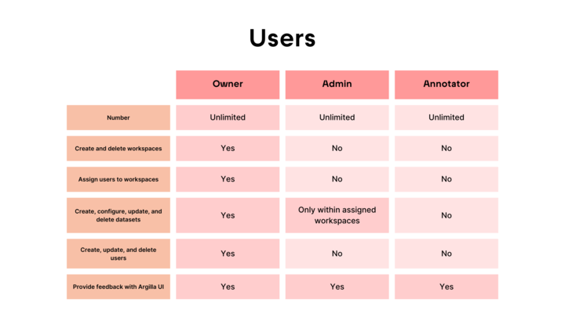

# User Management

This guide provides an overview of user roles and credentials, explaining how to set up and manage users in Argilla.

A **user** in Argilla is an authorized person, who depending on their role, can use the Python SDK and access the UI in a running Argilla instance.

We differentiate between three types of users depending on their role, permissions and needs: `owner`, `admin` and `annotator`. 

=== "Overview"
    

=== "Owner"

    The `owner` refers to the root user who created the Argilla instance. Using workspaces within Argilla proves highly beneficial for organizing tasks efficiently. So, the owner has full access to all workspaces and their functionalities:

    - **Workspace management**: It can create, read and delete a workspace.
    - **User management**: It can create a new user, assign it to a workspace, and delete it. It can also list them and search for a specific one.
    - **Dataset management**: It can create, configure, retrieve, update, and delete datasets.
    - **Annotation**: It can annotate datasets in the Argilla UI.
    - **Feedback**: It can provide feedback with the Argilla UI.

=== "Admin"

    An `admin` user can only access the workspaces it has been assigned to and cannot assign other users to it. An admin user has the following permissions:

    - **Dataset management**: It can create, configure, retrieve, update, and delete datasets only on the assigned workspaces.
    - **Annotation**: It can annotate datasets in the assigned workspaces via the Argilla UI.
    - **Feedback**: It can provide feedback with the Argilla UI.

=== "Annotator"

    An `annotator` user is limited to accessing only the datasets assigned to it within the workspace. It has two specific permissions:

    - **Annotation**: It can annotate the assigned datasets in the Argilla UI.
    - **Feedback**: It can provide feedback with the Argilla UI.

!!! Question "Question: Who can manage users?"

    Only users with the `owner` role can manage (create, retrieve, delete) other users.

## rg.User

> Check the [User - Python Reference](../../reference/argilla_sdk/users.md) to see the attributes, arguments, and methods of the `User` class in detail.

```python
rg.User(
    username="username",
    first_name="first_name",
    last_name="last_name",
    role="owner",
    password="password",
    client=client
)
```

## Default users and credentials

Argilla provides a default user with the `owner` role to help you get started in Python and the UI. The credentials for this user vary depending on the server configuration.

| Environment                   | Username | Password    | API Key        |
|-------------------------------|----------|-------------|----------------|
| Quickstart Docker and HF Space | owner    | 12345678    | owner.apikey   |
| Server image                  | argilla  | 1234        | argilla.apikey |


## How-to guide

This section shows how to identify the currently active user in Argilla, allowing you to verify the correct credentials are used for user management. It then outlines the process of creating a user, listing them all and retrieving a specific one. Finally, it covers the steps to delete a user.

### Get current user

To ensure you're using the correct credentials for managing users, you can get the current user in Argilla using the `me` attribute of the `Argilla` class.

```python
import argilla_sdk as rg

client = rg.Argilla(api_url="<api_url>", api_key="<api_key>")

current_user = client.me
current_user
```

### Create a user

To create a new user in Argilla, you can define it in the `User` class and then call the `create` method. This method is inherited from the `Resource` base class and operates without modifications.

```python
import argilla_sdk as rg

client = rg.Argilla(api_url="<api_url>", api_key="<api_key>")

user_to_create = rg.User(
    username="my_username",
    first_name="my_first_name",
    last_name="my_last_name",
    role="owner",
    password="12345678",
    client=client
)

created_user = user_to_create.create()
created_user
```
!!! tip "Accessing attributes"
    Access the attributes of a user by calling them directly on the `User` object. For example, `user.id` or `user.username`.

### List users

You can list all the existing users in Argilla by accessing the `users` attribute on the `Argilla` class and iterating over them. You can also use `len(client.users)` to get the number of users.

```python
import argilla_sdk as rg

client = rg.Argilla(api_url="<api_url>", api_key="<api_key>")

users = client.users

for user in users:
    print(user)
```
!!! tip "Notebooks"
    When using a notebook, executing `client.users` will display a table with `username`, `id`, `role`, and the last update as `updated_at`.

### Retrieve a user

You can retrieve an existing user from Argilla by accessing the `users` attribute on the `Argilla` class and passing the `username` as an argument.

```python
import argilla_sdk as rg

client = rg.Argilla(api_url="<api_url>", api_key="<api_key>")

retrieved_user = client.users('my_username')
retrieved_user
```

### Delete a user

You can delete an existing user from Argilla by calling the `delete` method on the `User` class.

```python
import argilla_sdk as rg

client = rg.Argilla(api_url="<api_url>", api_key="<api_key>")

user_to_delete = client.users('my_username')

deleted_user = user_to_delete.delete()
```